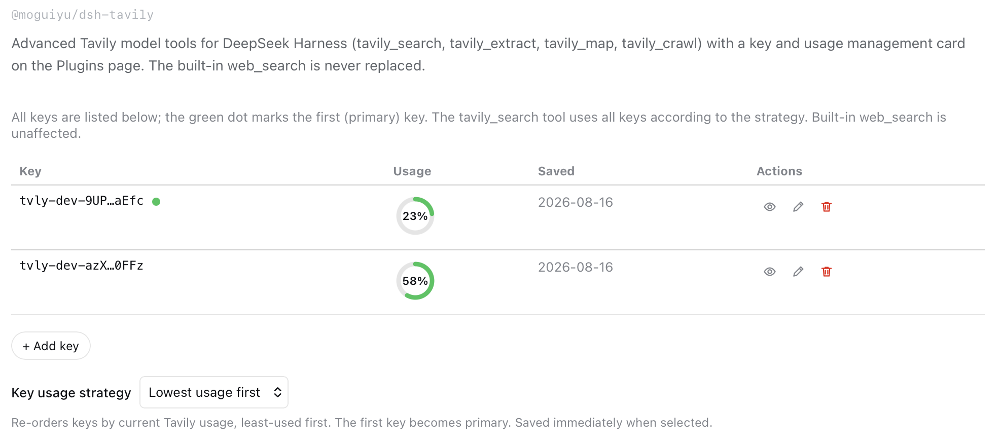

# dsh-tavily

为 [DeepSeek Harness](https://github.com/deepseek-ai/deepseek-harness)（DSH）提供 Tavily 网页搜索，支持**多个 Tavily API Key**、**自动轮换/故障转移**、**实时用量仪表盘**和完整的设置卡片。

## 亮点

- 🔑 **多 Tavily API Key** — 在 DSH 设置界面中管理扁平化 Key 列表。
- 🔁 **Key 轮换与故障转移** — 多 Key 轮询；遇到 HTTP 401/429 自动切换下一个 Key。
- 📊 **用量仪表盘** — 服务端获取每个 Key 的 Tavily 用量与汇总，不暴露 Key。
- 🎛️ **设置卡片** — 添加/删除/查看 Key、选择用量策略并查看用量。
- 🧩 **原生网页搜索提供方** — 通过 Tavily 提供 DSH 内置的 `web_search`。
- 🛠️ **Tavily 检索工具** — 添加 `tavily_extract`、`tavily_map` 与 `tavily_crawl`。

## 包

| 包 | 作用 |
|---|---|
| [`@moguiyu/dsh-tavily`](packages/dsh-tavily) | Tavily `web_search` 提供方、三个独立检索工具、设置卡片与本地后端 |

## 安装

最简单 — 一条命令，一个插件：

```sh
dsh plugin --profile web add github:moguiyu/dsh-tavily
```

或通过 npm 安装：

```sh
dsh plugin --profile web add @moguiyu/dsh-tavily
```

插件的 bundle 配置会将 DSH 原生 `web_search` 指向 Tavily。若 profile 覆盖了网页搜索提供方，请保留：

```yaml
- insert:
  - id: dsh-tavily
    name: '@moguiyu/dsh-tavily'
- id: web
  config:
    searchProvider: tavily
```

刷新浏览器后，卡片会出现在 **Settings → Plugins → plugin configuration**（`tavily-search`）。

## 凭据

- `TAVILY_API_KEYS` — `web_search`、`tavily_extract`、`tavily_map`、`tavily_crawl` 使用的逗号分隔 Key 列表
- `TAVILY_API_KEY` — 旧版单 Key 回退值，会自动同步为首个托管 Key

两者都由设置卡片自动管理。

## Key 用量策略

- **轮流使用每个 Key** — 轮询；遇到 401/429 自动尝试下一个。
- **按用量最少优先 / 用量最多优先** — 保存时按 Tavily 实时用量重新排序。

## 模型工具

启用插件后，模型会收到以下全部 Tavily 相关工具：

- `web_search` — 由 Tavily provider 支持的 DSH 原生网页搜索工具。
- `tavily_extract` — 获取已知 URL 的完整内容。
- `tavily_map` — 发现网站中的 URL。
- `tavily_crawl` — 发现并提取网站中的内容。

## 状态文件

- `~/.dsh/tavily-manager.json` — Key 保存日期 + 策略

权限 `600`，不保存密钥。

## 截图



## 开发

```sh
pnpm install
pnpm test
pnpm build
```

## 许可证

MIT

---

[English](README.md)
